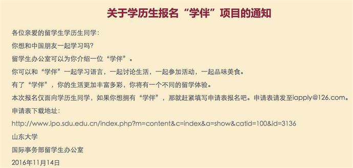
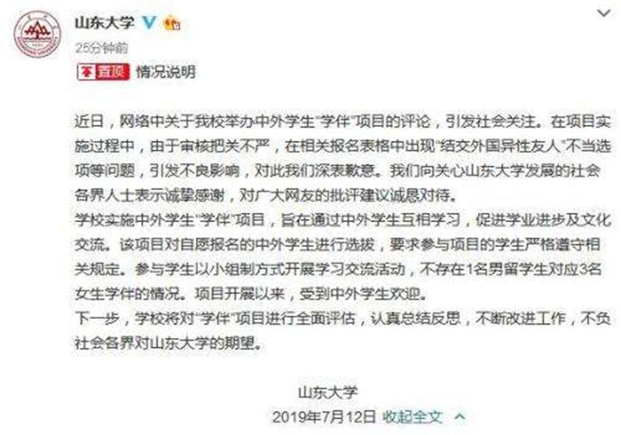
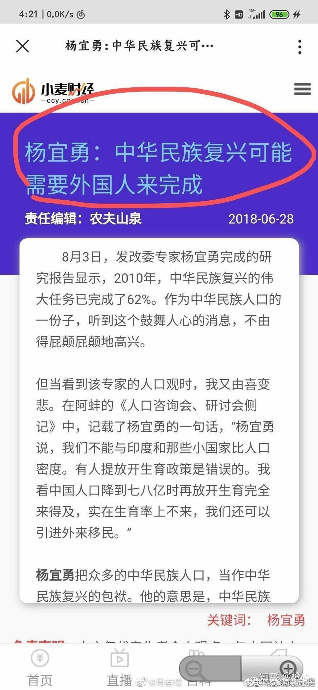

# 中华人民共和国外国人永久居留管理条例（征求意见稿）》
> 《中华人民共和国外国人永久居留管理条例（征求意见稿）》链接：http://zqyj.chinalaw.gov.cn/index

## 声明
1. 我是理性的爱国主义者，坚决贯彻党的领导方针，坚决拥护中国共产党的领导。
2. 没有种族歧视，只是在讨论中国的这一法规。
3. 内容如有侵权，或涉及敏感政治问题，请联系我，及时删除。

## 发声途径

1. 登录中国政府法制信息网（http://www.moj.gov.cn、http://www.chinalaw.gov.cn）或者中国法律服务网（http://www.12348.gov.cn），进入首页“立法意见征集”栏目提出意见。 
2. 通过电子邮件将意见发送至邮箱：YJJL2020@chinalaw.gov.cn（根据网友实践情况，要用163或者126的邮箱发才不会拒收。）

作者：不大玩手机的小白

链接：https://www.zhihu.com/question/375390722/answer/1044659027

来源：知乎

## 事件起因
1. 尼哥的梗
> 原文链接：https://www.faxingnet.com/zt/18282.html

尼哥就是英文igger的音译，这个词的原意是黑鬼，是对黑人的蔑称，一般来说不能轻易使用。
但是随着山东大学留学生“学伴”项目的出现，尼哥这个词就在国内火了起来，虽然说这个词看似是在嘲讽黑人留学生，
实则是在却是在嘲讽那些将黑人看的比国人高一等的学校。

今年5月份，山东因为一纸“为留学生找心仪学伴”的文件火了，
在网传的这份寻找学伴的申请表，分类很细，从专业到性别，到性格，到兴趣，
到交友目的（比如“结交外国异性友人”）……十分全面，而山东大学这么做为的就是帮国外黑人留学生寻找学伴，
而这些留学生大部分都是黑人留学生，也因此尼哥这个词就成了这群人的代名词。

虽然说曾担任2016年山东大学“学伴”招募计划的负责人7月11日对此澄清表示，“一对一”、“一对三”系网友恶意曲解。
他介绍，山东大学“学伴”计划成立之初，目的在于促进中外学生之间的交流，学生之间系自愿报名参加，“不存在一个留学生跟三名女生”配比。
不过随着之后越来越来越多的学校的留学生被曝享受高人一等的学员待遇后尼哥这个梗就就这么火了起来。

2. 杨宜勇
> 针对杨宜勇的发言，仅凭一个网易的记者报导不足以支持他`卖国` 的铁证，等待官方的澄清。

知乎网友.划水的蝉.评论:

